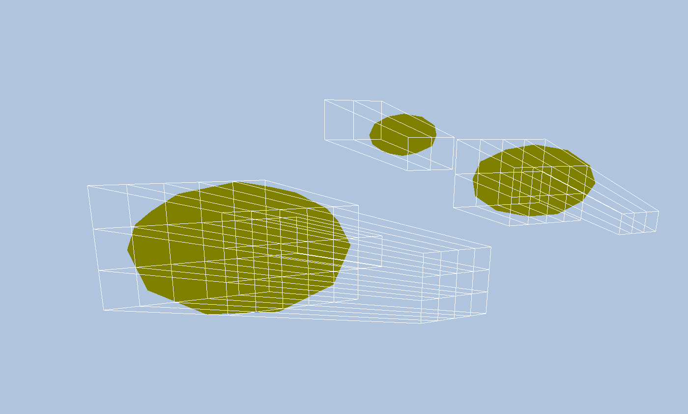
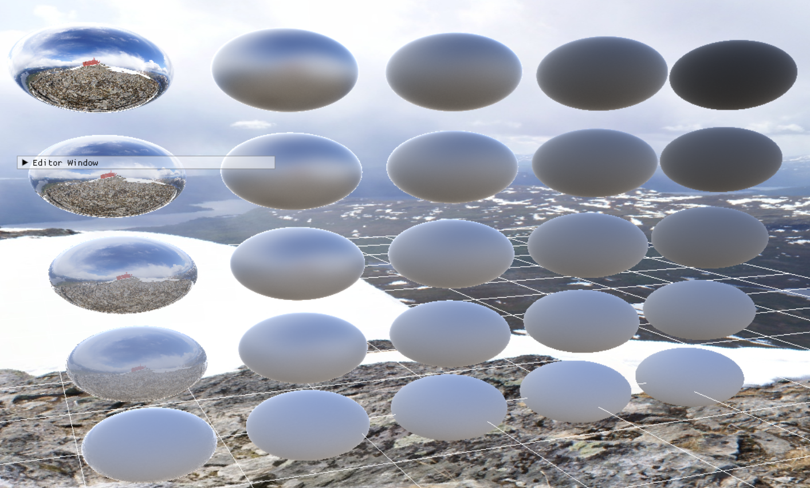

# DRenderer
DirectX12 简易3D渲染器
* 实现了从模型导入, 坐标变换, 到着色, 后处理, 成像的一整套渲染流水线
* 对基于物理的渲染, 基于图像的照明, 阴影映射, 天空盒, 后处理等内容进行了尝试与实践

### 开发过程:
* 第一个成功导入的模型

* 导入纹理贴图

* 阴影映射与天空盒

* 基于图像的照明

* 后处理与抗锯齿

* 基于物理的渲染, metallic-roughness work flow

